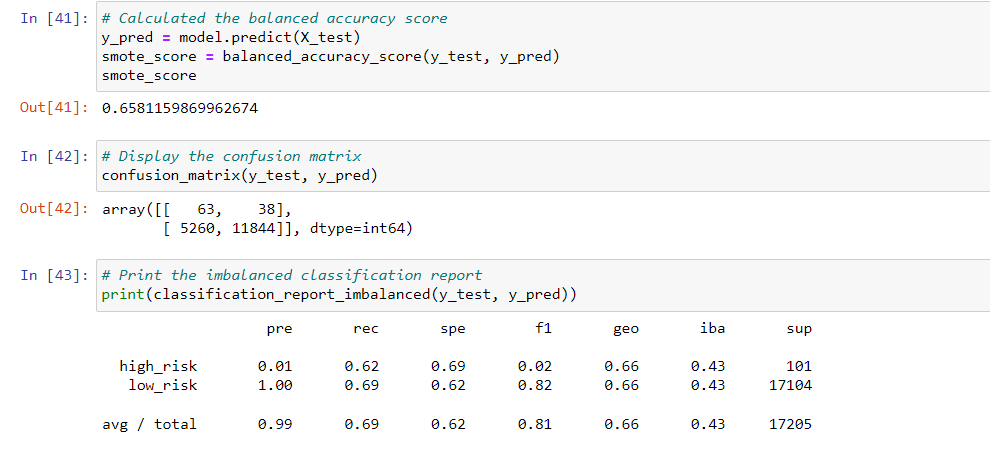

# Credit_Risk_analysis

## Overview – Purpose
The Purpose of the assignment was to use the credit card database from lendingClub, to oversample the data, undersample the data and compare the two machine learning models that reduce bias and predict credit risk. We will be using imbalanced-learn and scikit-learn libraries. Finally, we will also evaluate the performance of the models and make recommendations on whether they should be used to predict credit risk

## Results

* The balanced accuracy score Naive Random Sampling as indicated above is 66.1%. the precision for this sampling method is 0.01 for high risk and 1.00 for low risk. Finally, the recall for high risk is 0.72 and low risk at 0.60

*	The balanced accuracy score for the Smote method as indicated above is 65.8%.  in terms of precision, this was the same as the naive random sampling and finally, the recall was 0.62 for high risk and 0.69 for low risk

*	The balanced accuracy score is 65.8% with precision at 0.01 for high risk and 1.00 for low risk. Finally for recall, high risk was 0.62 and low risk at 0.69

*	The balanced accuracy score is 64.5% precision being consistent with previous models. The recall is 72% for high risk and 57% for low risk

*	The balanced accuracy score is 76.3% with precision being 0.03 for high risk and 1.00 for low risk. The recalls is 0.65 for high risk and 0.87 for low risk.

*	The balanced accuracy score predicts credit risk of 91.5% of the time. The precision score identify high risk applicants is 0.09 and 1.00 for low risk. Finally, the recall in this model is 0.89 for high risk and 0.94 for low risk applicants 

## Summary

The first four models utilized undersampled, oversampled and a combination of both in predicting loans with the highest risk. In these models, the accuracy score is lower than the last two models, which utilized ensemble classifiers. Each of the models varied in balanced accuracy, and had minimal differences in the precision. 
I would recommend the easy Ensemble AdaBoost Classifier is the best model to choose as it has the highest balanced accuracy of 91.5%. in addition, it also had the highest recall score than any of the other models. As a result, It may be the best model to predict credit risk accurately for applicants. 
